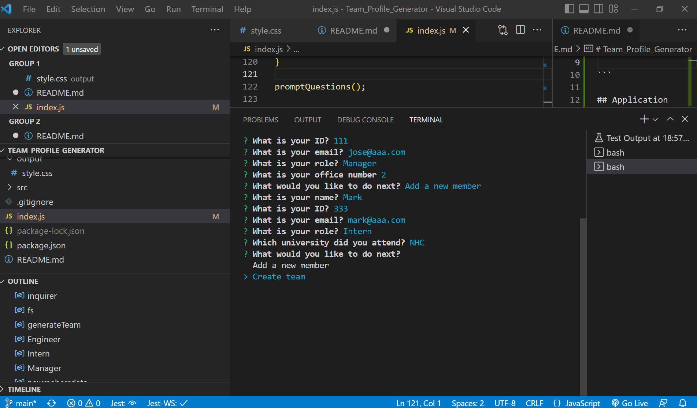

# Team_Profile_Generator


The project will generate a webpage that displays  basic info about a Team members.
So we can have a quick access to their emails and GitHub profiles

 
In addition a unit testing is written to make code maintainable, in every aspect.

# Deployment
Please find the repository link and the application deployment link.

***Repository***
https://github.com/silviaolinger/Team_Profile_Generator

***Application Deployment***
https://silviaolinger.github.io/Team_Profile_Generator/

# Application Criteria:
```


```md
GIVEN a command-line application that accepts user input
WHEN I am prompted for my team members and their information
THEN an HTML file is generated that displays a nicely formatted team roster based on user input
WHEN I click on an email address in the HTML
THEN my default email program opens and populates the TO field of the email with the address
WHEN I click on the GitHub username
THEN that GitHub profile opens in a new tab
WHEN I start the application
THEN I am prompted to enter the team manager’s name, employee ID, email address, and office number
WHEN I enter the team manager’s name, employee ID, email address, and office number
THEN I am presented with a menu with the option to add an engineer or an intern or to finish building my team
WHEN I select the engineer option
THEN I am prompted to enter the engineer’s name, ID, email, and GitHub username, and I am taken back to the menu
WHEN I select the intern option
THEN I am prompted to enter the intern’s name, ID, email, and school, and I am taken back to the menu
WHEN I decide to finish building my team
THEN I exit the application, and the HTML is generated
```

## Usage
***ScreenShots***
The following image shows screenshot of the generated HTML’s appearance and functionality:
- Data Input


- Creanting Index.html


- Index.html generated


- Index.html displayed


- Unit test performed


***Videos***
 - Data Input
https://drive.google.com/file/d/1jsqj91z5MCYGFmA-d4afyan7JNSAvr1U/view

- Webpage
https://drive.google.com/file/d/1dIe-BVCVR6g25k8Xk3DnMCBVWTXqDgxX/view

- Unit Test
https://drive.google.com/file/d/1gZ6shI5OaScsHEuYeSrjj-dMhRxfF550/view

## Getting Started
My application will use [Jest](https://www.npmjs.com/package/jest) for running the unit tests and [Inquirer](https://www.npmjs.com/package/inquirer) for collecting input from the user. The application will be invoked by using the following command:

`The application were devoloped using object-oriented programming. 

